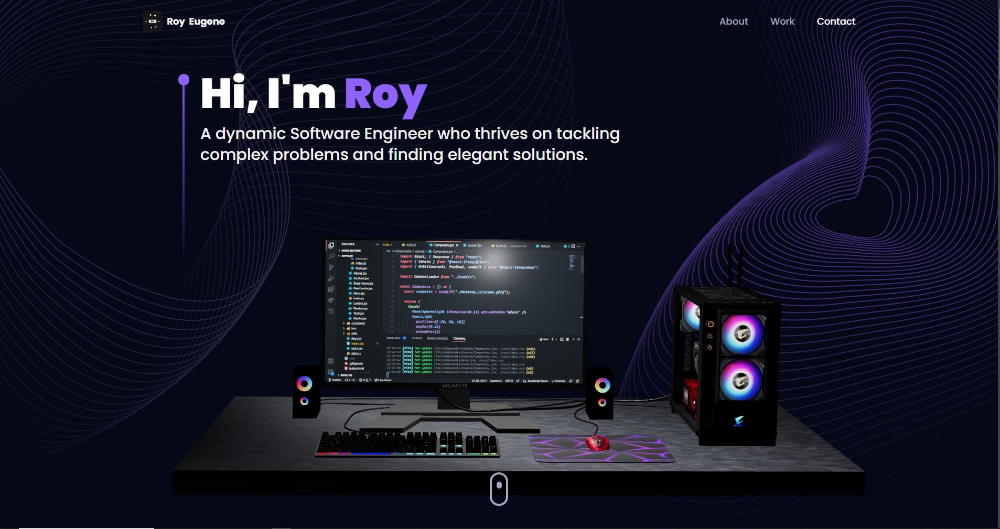

# Portfolio Website - React.js and Three.js



Welcome to my portfolio website repository! This project showcases my work and skills using React.js and Three.js to create a dynamic and visually appealing user experience. Whether you're a potential employer, client, or simply interested in exploring my projects, this portfolio website will provide an immersive and interactive journey.

## Table of Contents
- [Project Overview](#project-overview)
- [Features](#features)
- [Installation](#installation)
- [Usage](#usage)
- [Technologies and Libraries Used](#technologies-and-libraries-used)
- [Contributing](#contributing)
- [License](#license)

## Project Overview
The main objective of this project is to build a portfolio website that effectively presents my work and skills. The website serves as a showcase platform to highlight my projects, achievements, and expertise. It aims to leave a lasting impression on visitors through its visually captivating design and interactive elements.

## Features
- **Responsive Design:** The website is designed to adapt seamlessly to various devices, ensuring an optimal viewing experience for visitors.
- **Interactive User Interface:** Engaging visitors with an intuitive and user-friendly interface, allowing for easy navigation and exploration of projects.
- **3D Graphics and Animations:** Leveraging the power of Three.js, I have incorporated stunning 3D graphics and animations to creatively showcase my work.
- **Project Categorization and Filtering:** Visitors can explore my projects based on different categories, making it convenient to browse through specific areas of interest.
- **Contact and Inquiry Form:** An integrated contact form enables potential clients or employers to reach out to me easily.

## Installation
To set up and run the portfolio website locally on your machine, follow these steps:

1. Clone the repository:  
   ```
   git clone https://github.com/roy-eugene049/Roy-Portfolio-Website
   ```

2. Navigate to the project directory:  
   ```
   cd Roy-Portfolio-Website
   ```

3. Install the dependencies:  
   ```
   npm install
   ```

4. Start the local development server:  
   ```
   npm run dev
   ```

5. Open your web browser and visit `http://localhost:3000` to view the website.

## Usage
Once the website is up and running, you can navigate through the different sections and explore my projects. Experience the interactive elements and immersive 3D graphics created with Three.js. Feel free to use the contact form to get in touch with me for any inquiries or opportunities.

## Technologies and Libraries Used
- React.js
- Three.js
- HTML5
- CSS3
- JavaScript

## Contributing
I welcome contributions to enhance the portfolio website and its features. If you have any ideas, suggestions, or bug fixes, please feel free to submit a pull request. Together, we can make this portfolio website even more impressive and impactful.

## License
The content of this repository is licensed under the [MIT License](LICENSE). Feel free to use and modify the code for personal or commercial use.

---
Thank you for visiting my portfolio website repository! If you have any questions or feedback, please don't hesitate to reach out. Let's connect and create amazing things together!
